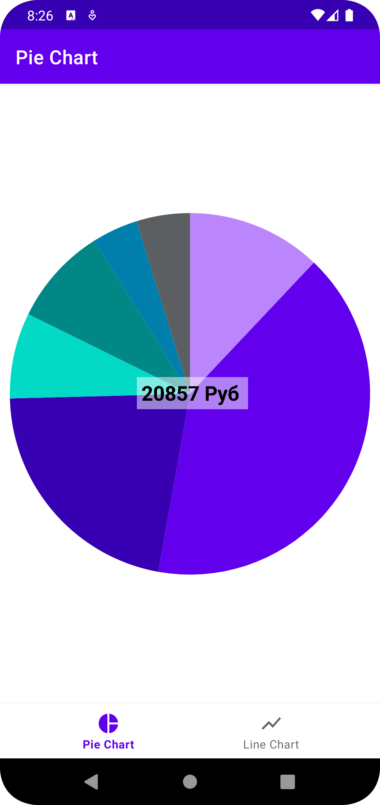

# Custom View

### Задание 1. Реализовать кастом View - график Pie Chart, на котором будем визуализировать траты по категориям:

1. Обязательно реализуйте метод onMeasure и учтите все возможные MeasureSpecs
2. Реализуйте механизм сохранения состояния внутри View
3. Предусмотрите как минимум 10 категорий(цветов) на графике
4. В качестве данных для визуализации используйте файл `payload.json`
5. Реализуйте механизм обработки клика на сектор - по клику на часть графика должен срабатывать коллбек, в качестве аргумента - категория на которой был клик евент.

Итог:

### Задание 2. Реализуйте еще одну кастомную View - график детализацию категории, чтобы можно было смотреть траты по одной категории в динамике:

По оси Y сумма трат в день, по оси Х дата(шаг по оси Х = 1 дню)

1. Обязательно реализуйте метод onMeasure и учтите все возможные MeasureSpecs
2. Реализуйте механизм сохранения состояния внутри View
3. В качестве данных для визуализации используйте файл `payload.json`
4. Реализовывать масштабирование/скроллинг/обработку тач евентов не нужно

Итог:
