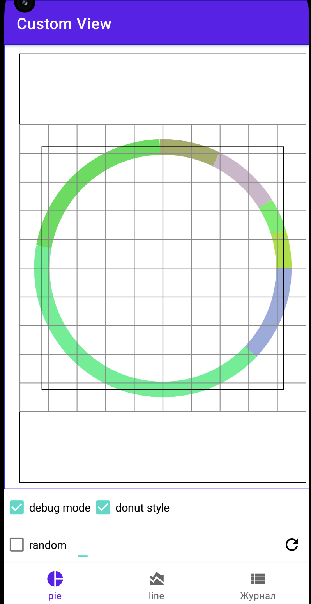

# Custom View

### Задание 1. Реализовать кастом View - график Pie Chart, на котором будем визуализировать траты по категориям:

1. Обязательно реализуйте метод onMeasure и учтите все возможные MeasureSpecs
2. Реализуйте механизм сохранения состояния внутри View
3. Предусмотрите как минимум 10 категорий(цветов) на графике
4. В качестве данных для визуализации используйте файл `payload.json`
5. Реализуйте механизм обработки клика на сектор - по клику на часть графика должен срабатывать коллбек, в качестве аргумента - категория на которой был клик евент.

### Задание 2. Реализуйте еще одну кастомную View - график детализацию категории, чтобы можно было смотреть траты по одной категории в динамике:

По оси Y сумма трат в день, по оси Х дата(шаг по оси Х = 1 дню)

1. Обязательно реализуйте метод onMeasure и учтите все возможные MeasureSpecs
2. Реализуйте механизм сохранения состояния внутри View
3. В качестве данных для визуализации используйте файл `payload.json`
4. Реализовывать масштабирование/скроллинг/обработку тач евентов не нужно

### Решение

Приложение позволяет отображать данные по расходам в виде линейного и кругового графика.
Присутствует возможность использовать данные из имеющегося файла и сгенерированные случайные данные.

Для кругового графика предусмотрен стиль отображения "бублик". Цвет сегментов также генерируется
случайно.

Каждый график позволяет отобразить отладочную информацию в виде сетки и границ графиков.

Графики поддерживают выставление padding-ов и обработку onMeasure.

Дополнительно имеется экран отображения полной информации по каждому расходу.

Круговой график

Круговой график в стиле "бублик"

Круговой график с отладочной информацией

Круговой график в стиле "бублик" с отладочной информацией

Круговой график с выбранным сектором

Круговой график в стиле "бублик" с выбранным сектором

Линейный график

Линейный график с отладочной информацией

Линейный график со списком категорий

Журнал
